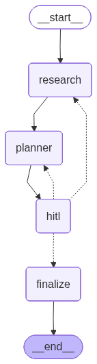

# AI Travel Planner - Backend

Multi-agent travel planning system built with **FastAPI + LangGraph**, with a human-in-the-loop (HITL) approval step.

A user submits a travel request. A **Research Agent** gathers destination intel using `web_search` (Serper) and `get_weather` (OpenWeather). An **Itinerary Planner Agent** turns that into a day-by-day plan using `allocate_budget` and `generate_packing_list`. The workflow pauses for the user to approve, reject, or modify the draft, and only then produces the final plan.

All monetary fields are in **INR**.

---

## Architecture



```
              FastAPI (main.py + src/api)
              POST /plan        GET  /plan/{id}
              POST /plan/{id}/review   GET /plan/{id}/final
                              |
                              v
              LangGraph orchestrator (src/graph/workflow.py)

  START -> research -> planner -> hitl -+-> finalize -> END
              ^           ^             |
              |           |             |
       reject(facts)      |    reject(pacing) / modify(pacing)
              |           +-------------+
              +---------- modify(facts) -+
                       (LLM classifier decides which agent re-runs)

  approve ------------------> finalize
```

- **Research Agent** ([src/agents/research_agent.py](src/agents/research_agent.py)) - `create_react_agent` with `[web_search, get_weather]`, returns a structured `ResearchOutput` via `response_format`.
- **Itinerary Planner Agent** ([src/agents/itinerary_agent.py](src/agents/itinerary_agent.py)) - `create_react_agent` with `[allocate_budget, generate_packing_list]`, returns a structured `Itinerary`.
- **HITL** ([src/graph/nodes/hitl_node.py](src/graph/nodes/hitl_node.py)) - uses `langgraph.types.interrupt`. State is checkpointed in `MemorySaver` keyed on `thread_id == plan_id`, so the API can pause across requests and resume with `Command(resume=...)`.
- **Reject / Modify routing** ([src/helpers/feedback_router.py](src/helpers/feedback_router.py)) - both actions feed the user's free-form `feedback` into an LLM classifier. Feedback about destination facts (missing places, weather, safety) routes to **research**; feedback about pacing, swapping, or budget routes to **planner**. The UI labels them differently; the backend logic is identical.
- **Async execution** - `POST /plan` and `POST /plan/{id}/review` return immediately. The workflow runs in a daemon thread; the client polls `GET /plan/{id}` to watch `stage` progress through `research -> planning -> awaiting_review -> final`.

State persists in LangGraph's `MemorySaver` per `thread_id == plan_id`. A small `SessionManager` ([src/api/session/session_manager.py](src/api/session/session_manager.py)) keeps an in-memory registry of plan IDs. Swap both for SQLite / Postgres / Redis in production.

---

## Project layout

```
backend/
├── main.py                       FastAPI entrypoint (app + middleware)
├── requirements.txt
├── .env.example
└── src/
    ├── api/
    │   ├── routers/plan_route.py        /plan endpoints (async workflow)
    │   ├── schemas/plan_schema.py       Pydantic TravelRequest / ReviewRequest
    │   └── session/session_manager.py   In-memory plan registry
    ├── agents/
    │   ├── research_agent.py            Agent 1 (web_search + get_weather)
    │   └── itinerary_agent.py           Agent 2 (allocate_budget + packing)
    ├── prompts/
    │   ├── research_prompt.py
    │   ├── itinerary_prompt.py
    │   └── feedback_router_prompt.py    Classifier for reject/modify routing
    ├── tools/
    │   ├── web_search.py                Serper.dev  (Agent 1, mandatory)
    │   ├── weather.py                   OpenWeather (Agent 1, second)
    │   ├── budget_allocator.py          Agent 2, first tool
    │   └── packing_list.py              Agent 2, second tool
    ├── graph/
    │   ├── workflow.py                  StateGraph + MemorySaver checkpointer
    │   ├── state.py                     TravelState TypedDict
    │   └── nodes/
    │       ├── research_node.py
    │       ├── planner_node.py
    │       ├── hitl_node.py             interrupt() pause point
    │       └── finalize_node.py
    ├── models/travel_models.py          ResearchOutput, Itinerary, DayPlan
    ├── helpers/
    │   ├── llm.py                       get_llm() reads OPENAI_MODEL from env
    │   ├── feedback_router.py           LLM classifier
    │   └── logger.py
    └── __init__.py
```

---

## Setup

Requires Python 3.12+.

```bash
cd backend
python -m venv .venv && source .venv/bin/activate
pip install -r requirements.txt
cp .env.example .env
# then fill in the keys (see below)
```

### Required env vars

| Var | Required | Get it from |
| --- | --- | --- |
| `OPENAI_API_KEY` | yes | https://platform.openai.com |
| `OPENAI_MODEL` | no (default `gpt-4o-mini`) | any model ID your key can access (e.g. `gpt-4o`, `gpt-4o-mini`, `gpt-4-turbo`) |
| `SERPER_API_KEY` | yes (for real research) | https://serper.dev - 2,500 free queries on signup |
| `OPENWEATHER_API_KEY` | yes (for real weather) | https://openweathermap.org/api - free tier |

If `SERPER_API_KEY` or `OPENWEATHER_API_KEY` is missing, the corresponding tool returns a graceful `no results` string and the workflow keeps running.

---

## Run

```bash
uvicorn main:app --reload --port 8000
```

Swagger docs: <http://localhost:8000/docs>

---

## API

| Method | Endpoint | Purpose |
| --- | --- | --- |
| `POST` | `/plan` | Submit a new travel request. Returns immediately with `plan_id`; workflow runs in the background. |
| `GET`  | `/plan/{id}` | Current stage, draft itinerary, research output, and any pending review prompt. Poll this to watch progress. |
| `POST` | `/plan/{id}/review` | Approve / reject / modify. Returns immediately; the resumed workflow runs in the background. |
| `GET`  | `/plan/{id}/final` | Finalized itinerary. `409` until approved. |
| `GET`  | `/health` | Liveness probe. |

### 1. Submit a request

```bash
curl -X POST http://localhost:8000/plan \
  -H "Content-Type: application/json" \
  -d '{
    "destination": "Goa, India",
    "start_date": "2026-06-10",
    "end_date":   "2026-06-13",
    "travelers": 2,
    "budget": 80000,
    "interests": ["beach", "food"]
  }'
```

Returns immediately:

```json
{
  "plan_id": "3fdd812c-bd02-4077-9aa6-e9ac2c997e17",
  "stage": "research",
  "review_endpoint": "/plan/3fdd812c-.../review",
  "destination": "Goa, India",
  "start_date": "2026-06-10",
  "end_date": "2026-06-13",
  "travelers": 2,
  "budget": 80000.0,
  "interests": ["beach", "food"]
}
```

### 2. Poll the draft

```bash
curl http://localhost:8000/plan/<plan_id>
```

`stage` moves `research -> planning -> awaiting_review` (typically 40-60s end-to-end for a 4-day trip). When `stage == "awaiting_review"`, `draft_itinerary` is populated and `pending_review` is non-null.

### 3a. Approve

```bash
curl -X POST http://localhost:8000/plan/<plan_id>/review \
  -H "Content-Type: application/json" \
  -d '{"action": "approve"}'
```

### 3b. Reject with feedback

```bash
curl -X POST http://localhost:8000/plan/<plan_id>/review \
  -H "Content-Type: application/json" \
  -d '{
    "action": "reject",
    "feedback": "You missed Fushimi Inari, please add it"
  }'
```

The LLM classifier inspects the feedback. Destination-facts feedback like the above routes through `research -> planner -> hitl` and pauses again. Pacing feedback like *"Day 2 is too packed, slow it down"* routes through `planner -> hitl` only.

### 3c. Modify

```bash
curl -X POST http://localhost:8000/plan/<plan_id>/review \
  -H "Content-Type: application/json" \
  -d '{
    "action": "modify",
    "feedback": "Swap Day 3 temple for a cooking class. Prefer ryokan over hotel."
  }'
```

`modify` uses the same classifier as `reject`. The only difference is the UI label and intent. (Originally `modify` only re-ran the planner, but that meant feedback like *"add a famous attraction"* never re-researched. Both paths now share the classifier so the right agent runs regardless of which button the user clicked.)

### 4. Fetch the final plan

```bash
curl http://localhost:8000/plan/<plan_id>/final
```

Returns the finalized itinerary, including:
- `days[]` with morning / afternoon / evening, theme, `estimated_cost` (INR)
- `budget_breakdown` with `accommodation`, `food`, `activities`, `transport`, `miscellaneous`, plus a `per_person_total`
- `packing_list[]` (weather + interest aware)
- `currency: "INR"`

---

## Design decisions and tradeoffs

- **Two real agents via `create_react_agent`.** Each agent has its own tool list and decides when (and how many times) to call each. The LLM, not deterministic code, drives tool use - which is the whole point of an agent.

- **Structured outputs via `response_format=Pydantic`.** The agent finishes with a structured-output call, so the API never has to parse free-form text. `Itinerary` and `ResearchOutput` are the contract.

- **LangGraph `interrupt` + `MemorySaver` for HITL.** The graph literally pauses inside `hitl_node`; the API resumes with `Command(resume=...)`. State survives the pause naturally because LangGraph checkpoints around the interrupt. For production, swap `MemorySaver` for `SqliteSaver` / `PostgresSaver`.

- **Async workflow execution.** Each agent run is long (~30-60s). Holding the HTTP request open the whole time hides progress from the user. The route handlers kick off a daemon thread and return immediately with `stage: "research"`; the client polls `/plan/{id}` to watch the stage transition. The frontend renders a multi-step indicator from this poll.

- **One classifier for both reject and modify.** The UI distinguishes them as separate buttons, but both ultimately ask "should we re-research or just re-plan?" Running the same `feedback_router` on both means a modify like *"add the most famous attraction"* still triggers research, which is what the user actually wants.

- **Budget is INR-only.** The PDF asked for a budget range; we collapsed to a single ceiling for simplicity and hardcoded the currency to INR. Tools, prompts, and structured outputs all reference INR explicitly. The `Itinerary.currency` field is force-overwritten in `planner_node` so the LLM can't silently fall back to USD.

- **Tools degrade gracefully.** If a key is missing or the upstream service errors, the tool returns a short fallback string and the agent continues. A transient Serper / OpenWeather failure never kills the whole workflow.

- **Raw tool responses logged.** `web_search`, `get_weather`, `allocate_budget`, and `generate_packing_list` all log their full responses to `logs/app.log` for debugging and audit.

- **Configurable model.** `OPENAI_MODEL` is read from `.env` (default `gpt-4o-mini`). Swap to a stronger model for better itineraries at higher cost.

---

## What I would improve with more time

- Persistent checkpointer (SQLite / Postgres) so plans survive process restarts.
- Real flight / hotel price tool (Skyscanner / Amadeus) instead of LLM-generated price descriptions.
- Per-day patch endpoint (`PATCH /plan/{id}/day/{n}`) for surgical edits instead of LLM-mediated revisions.
- Server-sent events / WebSocket for live stage updates instead of 4s polling.
- Auth, rate limiting, per-user session isolation.
- Tests: unit tests on each tool with mocked HTTP, plus an integration test that walks a session through approve, reject, modify.
- LangSmith tracing for token cost and latency per agent step.
- Tighter prompt tuning for budget honoring - the planner sometimes prices low.

## Assumptions

- One user per session; no auth (take-home scope).
- Current weather is a reasonable proxy for the travel window. A forecast API would be more accurate for trips far in the future.
- Budgets are in INR; the LLM is instructed not to silently convert.
- `gpt-4o-mini` is good enough for the structured outputs; no validator retry loop.
- LangGraph checkpointer semantics for `interrupt` and `Command(resume=...)` are as documented at the time of writing.
